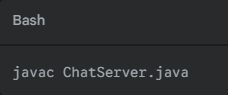
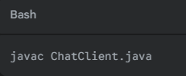
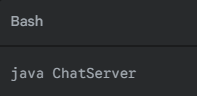
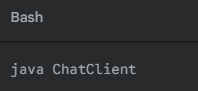
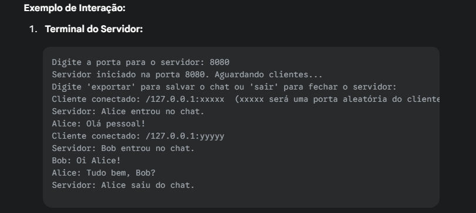
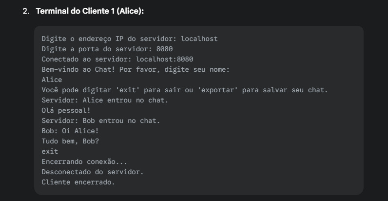
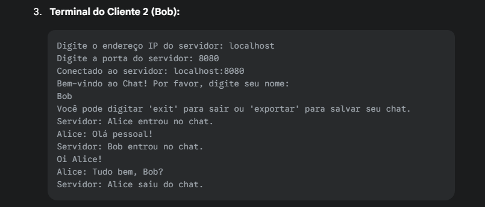

## Explicação do Servidor:

- **Este código implementa um sistema de chat simples baseado em sockets, com um servidor (ChatServer.java) que gerencia múltiplas conexões de clientes e um cliente (ChatClient.java) que permite aos usuários se conectarem ao servidor e trocarem mensagens.**

## ChatServer classe principal

# Funcionalidades do Código:

Log de Chat: Tanto o servidor quanto o cliente mantêm um log das mensagens trocadas.
Exportação de Log: Ambos podem exportar seus respectivos logs de chat para arquivos de texto (chat_log_server.txt e chat_log_client.txt). O log é anexado ao arquivo existente, permitindo múltiplas exportações.

ChatServer.java 🖥️:

Gerenciamento de Múltiplos Clientes: O servidor é capaz de lidar com várias conexões de clientes simultaneamente usando um ExecutorService (pool de threads).
Porta Configurável: O administrador do servidor define a porta em que o servidor escutará por conexões ao iniciá-lo.

Recepção de Conexões: Aguarda e aceita novas conexões de clientes.

ClientHandler: Para cada cliente conectado, uma nova thread ClientHandler é criada para gerenciar a comunicação individual com esse cliente.

Nome do Cliente: Ao se conectar, o servidor solicita ao cliente um nome. Se nenhum nome for fornecido, um nome padrão ("Anônimo" + endereço do cliente) é atribuído.

Broadcast de Mensagens: Mensagens recebidas de um cliente são retransmitidas (broadcast) para todos os outros clientes conectados. O servidor também exibe essas mensagens em seu console.

Notificações de Conexão/Desconexão: O servidor anuncia no chat quando um cliente entra ou sai.

Comandos do Administrador (via console do servidor):
exportar: Salva o log de chat do servidor.
sair: Encerra o servidor, notifica todos os clientes conectados, fecha todas as conexões e o socket do servidor, e desliga o pool de threads.

Remoção de Clientes: Remove clientes da lista ativa quando eles se desconectam ou a conexão é perdida.

ChatClient.java 💻:

Conexão ao Servidor: O usuário especifica o endereço IP e a porta do servidor para se conectar.

Interface de Linha de Comando: A interação com o chat é feita através do console.

Thread Dedicada para Recebimento: Uma thread separada (serverListener) é usada para escutar continuamente as mensagens enviadas pelo servidor, permitindo que o usuário digite mensagens ao mesmo tempo.

Envio de Mensagens: O usuário digita mensagens no console, que são enviadas ao servidor.

Log Local: As mensagens enviadas pelo usuário e recebidas do servidor são adicionadas ao clientChatLog.

Comandos do Cliente (via console do cliente):
exportar: Salva o log de chat local do cliente. Esta ação é local e não envia o comando "exportar" ao servidor.
exit: Envia uma notificação de saída ao servidor e encerra a conexão do cliente.

Tratamento de Desconexão:
Se o servidor encerrar a conexão, o cliente é notificado e se desconecta.
Em caso de perda de conexão ou erro, o cliente tenta fechar seus recursos e encerrar.

# Como Compilar e Executar:

Compilação ⚙️:
Abra um terminal ou prompt de comando e navegue até o diretório onde você salvou os arquivos ChatServer.java e ChatClient.java.

Compile o ChatServer.java:

Isso criará um arquivo ChatServer.class (e ClientHandler.class implicitamente, pois ClientHandler está no mesmo arquivo ou é uma classe interna/dependência direta que o compilador resolve).

Compile o ChatClient.java:

Isso criará um arquivo ChatClient.class.

Execução ▶️:
1. Inicie o Servidor:
Execute o servidor primeiro, pois os clientes precisarão se conectar a ele.

No terminal, execute:

O servidor solicitará que você digite a porta para ele escutar (ex: 8080). Após fornecer a porta, ele começará a aguardar conexões de clientes e exibirá "Servidor iniciado na porta [porta]. Aguardando clientes...".
O console do servidor também permitirá que você digite exportar para salvar o log do chat ou sair para encerrar o servidor.

2. Inicie o(s) Cliente(s):
Abra um novo terminal (ou múltiplos, se quiser simular vários clientes) para cada instância do cliente.
Navegue até o diretório onde os arquivos .class foram gerados (o mesmo da compilação).

Execute o cliente:

O cliente solicitará:
Digite o endereço IP do servidor: Se o servidor estiver rodando na mesma máquina, você pode usar localhost ou 127.0.0.1. Se estiver em outra máquina na rede, use o endereço IP dessa máquina.

Digite a porta do servidor: Use a mesma porta que você especificou ao iniciar o ChatServer.

Após conectar, o servidor pedirá seu nome. Digite seu nome e pressione Enter.

Agora você pode enviar mensagens. Outros clientes conectados receberão suas mensagens, e você receberá as deles.

No console do cliente, você pode digitar exportar para salvar seu log de chat local ou exit para se desconectar do servidor.

